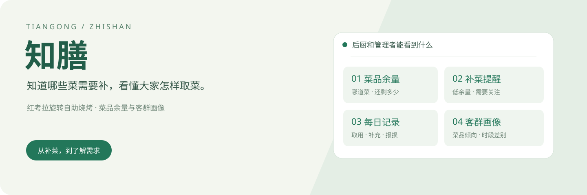
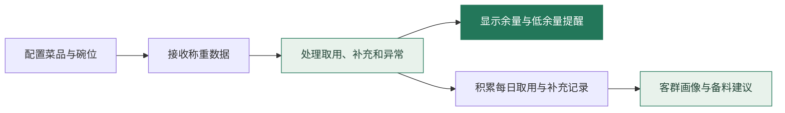
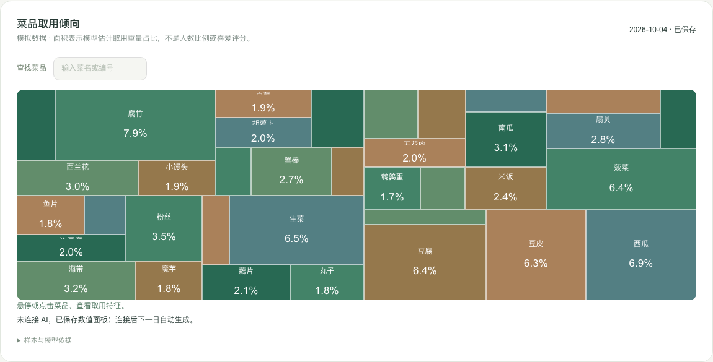
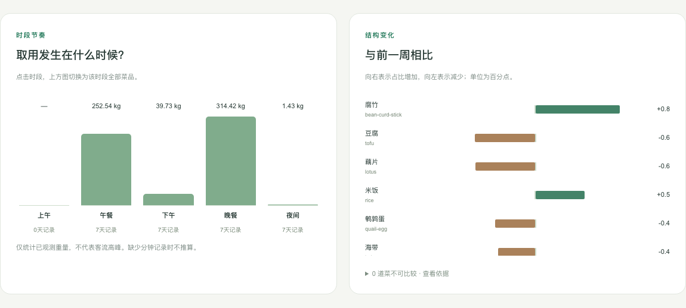
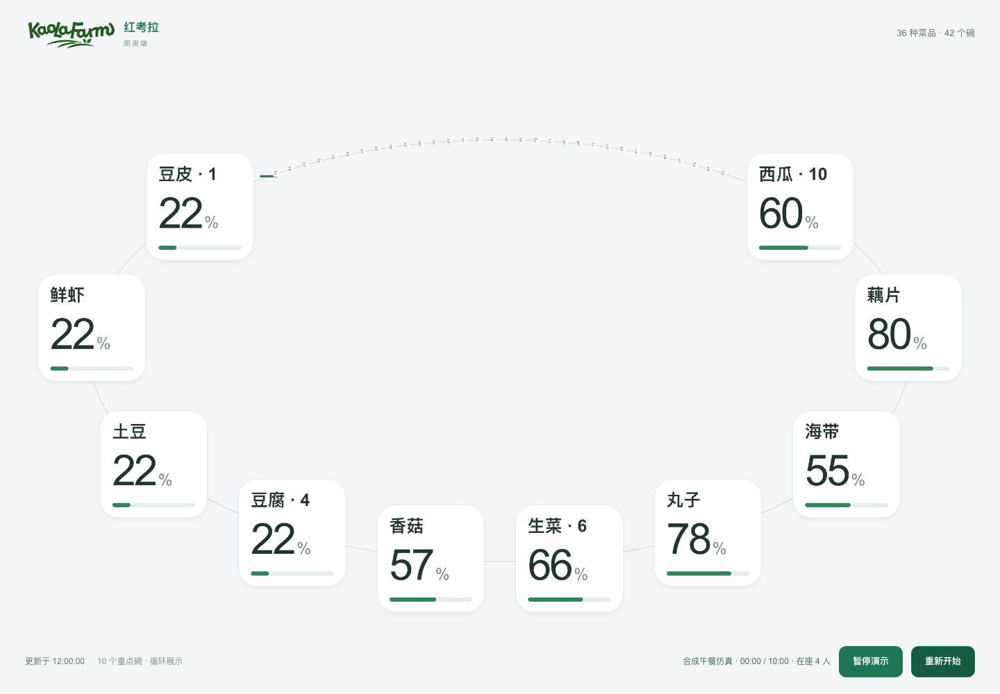

企业赛道赛题四-知膳-天工



红考拉旋转自助烧烤的菜品随旋转线不断流转，顾客随时夹取。后厨需要及时知道：**哪些菜快不够了，还剩多少，该怎样安排补菜？**

知膳利用称重记录跟踪菜品余量，把需要关注的菜显示给后厨；再把每天积累的取用记录整理成客群画像，帮助管理者了解用餐需求、安排后续供餐。

[怎样支持补菜](#怎样知道哪些菜需要补) · [客群画像](#大家更常取哪些菜) · [午餐仿真](#看看一顿午餐是怎样运行的) · [本地运行](#本地体验)

## 怎样知道哪些菜需要补？

先配置菜品与碗位的对应关系，再由联网秤上报重量。系统处理重量变化，区分取用、补充和异常，更新管理端与厨房端。



- **眼前需要关注什么**：厨房看板显示菜名、碗位和余量，低余量时提示及时补菜；离线或异常会单独显示，不当作菜已用完。
- **已经补了多少**：重量变化经处理后形成补充记录，可在每日总结中查看上台补充量，与取用、剩余和报损一起复盘。
- **下一餐准备多少**：根据历史取用生成备料建议，由管理者调整和确认。备料建议与当前碗位的即时补菜量是两件事。

技术实现采用称重与已配置的菜品对应关系，菜名不依赖摄像头辨认。重量记录经过校验和事件处理后进入同一套后端，供看板、统计和画像使用。[查看接入协议](red-koala/docs/INTEGRATION.md)

## 大家更常取哪些菜？

一次余量变化回答眼前是否要补菜，连续多天的记录则帮助我们了解这群用餐者的取用倾向。这里的**用户画像是客群画像**，描述整体需求，不识别个人身份。



**每一块代表一道菜，面积越大，模型估计的取用重量占比越高。** 可以点击或搜索菜品，查看对应信息；这反映取用倾向，不是人数比例或喜爱评分。

## 不同时段，取菜情况有什么差别？



**左侧看取用发生在哪些时段，右侧看菜品占比与前一周相比怎样变化。** 页面支持选择周和日期，点击时段还能查看该时段的菜品分布，为调整供餐安排提供依据。

> 两张图来自完整合成数据演示环境。取用量按重量统计，不是营业销量；没有记录的时段保持缺失，不按零取用处理。

## 日常工作中，还能用它做什么？

| 需要做的事 | 对应功能 |
| --- | --- |
| 查看旋转线上的菜 | 实时查看碗位余量、设备状态和待确认异常 |
| 回看一天的供餐 | 查看各菜取用、上台补充、剩余、报损及七日趋势 |
| 核对准备与补充情况 | 记录实际备料，对照已确认计划和秤记录的补充量 |
| 安排后续备料 | 查看预测建议，填写调整量和理由后确认计划 |
| 进一步理解画像 | 可连接模型获取文字解读；基础统计和数值画像不依赖联网模型 |

## 看看一顿午餐是怎样运行的



36 种菜、42 个碗位随模拟用餐过程变化。打开 `/demo/lunch/kitchen`，可以暂停观察、继续播放，或重新开始，体验厨房看板怎样呈现余量变化。

仿真使用合成数据，界面保留“红考拉”场景标识。它用于演示操作过程和软件运行，不代表真实门店经营结果。

## 五项完整交付

| 内容 | 源码 / 数据 | 演示方式 |
| --- | --- | --- |
| 可演示前端 | `red-koala/app`、`components` | 管理端、厨房端、智能分析 |
| 演示游戏 | `app/demo/lunch`、`lib/demo` | 午餐仿真，暂停 / 继续 / 重启 |
| 真实后端 | `app/api`、`lib`、`drizzle` | 本地 Worker + D1，真实 HTTP 接入与持久化 |
| 完整数据集 | [datasets](datasets/README.md) | 33 天、36 菜、42 碗、1,188 批次；约 16 MB 压缩包 |
| 用户画像模拟程序 | `sample-provider/lib`、`scripts/profile-simulation.mjs` | 顾客行为生成、日观测画像及完整页面分析 |

## 本地体验

需要 **Node.js 24、Python 3.9+**。在仓库根目录：

```sh
npm run install:all
npm run demo
```

保持服务运行，另一终端导入完整合成数据：

```sh
npm run demo:seed
```

默认访问 **http://127.0.0.1:5273**。午餐游戏 `/demo/lunch/kitchen` 无需等待历史导入；管理端 `/admin`、厨房端 `/kitchen`、画像 `/admin?view=intelligence` 在导入完成后展示完整历史。

```sh
npm run demo:smoke        # 验证演示页面及真实 API 控制
npm run simulate:profile # 从完整观测数据计算离线画像
```

[完整演示指南](docs/DEMO.md) · [数据集与校验](datasets/README.md) · [常规开发指南](docs/DEVELOPMENT.md)

AI 文字解读需要自行配置模型密钥；本地统计与画像算法不依赖联网模型。演示数据和用户行为均为固定种子合成，不代表实际门店或真实顾客。

## 工程结构

```text
red-koala/          完整应用：页面、API、领域逻辑、迁移与测试
sample-provider/    独立模拟器、合成历史生成与验证
ui-preview/         浏览器检查脚本
datasets/           完整合成数据压缩包与校验清单
scripts/            演示启动、数据导入、画像模拟与发布检查
docs/               开发指南、验证记录与产品展示
```

[系统架构](red-koala/docs/ARCHITECTURE.md) · [接入协议](red-koala/docs/INTEGRATION.md) · [智能分析](red-koala/docs/INTELLIGENCE.md) · [验证记录](docs/VALIDATION.md)

## 所有权与使用

作品署名 **天工**，仓库由 [liiiyiiixiii](https://github.com/liiiyiiixiii) 维护。原创内容由其合法权利人保留权利；公开可见不表示授予额外复用或商业许可。GitHub 条款赋予的浏览、fork 等权限及第三方原有许可证不受本声明影响。

[权利保留声明](LICENSE) · [作品署名](NOTICE.md) · [第三方声明](THIRD_PARTY_NOTICES.md)。本次公开不是版权登记或权属认定；GitHub 对公开仓库许可的说明见 [官方文档](https://docs.github.com/en/repositories/managing-your-repositorys-settings-and-features/customizing-your-repository/licensing-a-repository)。
