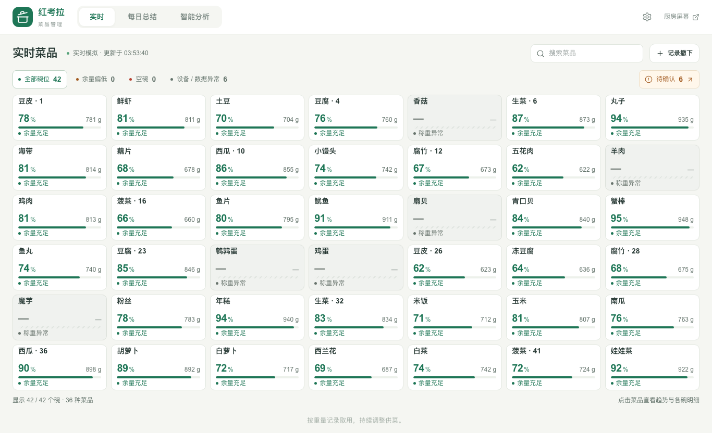
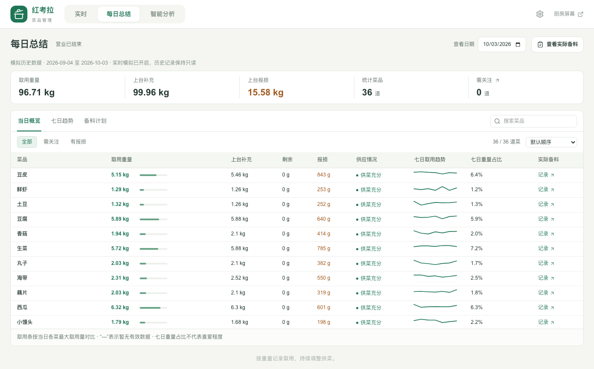
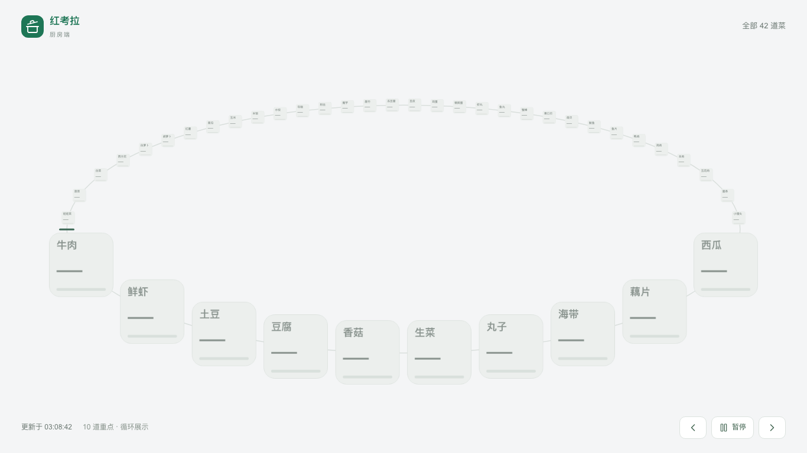
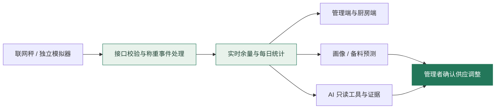

企业赛道赛题四-知膳-天工


<p align="center"><strong>让每一盘菜的变化，成为更有依据的供餐决策。</strong><br/>称重感知 · 实时看板 · 厨房协同 · 经营分析</p>

<p align="center"><a href="#作品一览">作品一览</a> · <a href="#从观测到决策">工作流程</a> · <a href="#本地体验">本地体验</a> · <a href="#所有权与使用">所有权与使用</a></p>

## 作品一览

知膳面向旋转小火锅的供餐场景，把联网秤上报转为可追溯的取用、补充与异常记录，让管理者查看全局，让厨房关注眼前需要补充的菜品。

| 看见现场 | 复盘一天 | 支持决策 |
| :--- | :--- | :--- |
| **实时菜品矩阵**：余量、状态、待确认变化 | **每日总结**：取用、补充、报损与趋势 | **备料计划**：预测建议、人工确认与执行记录 |
| **厨房环形看板**：按碗位呈现，突出当前重点 | **供应管理**：放置时间、撤下及留存 | **智能分析**：群体画像、只读工具调用与证据导出 |

### 01 · 管理者，一屏掌握菜品状态



显示各碗位余量、缺测和异常。未知状态保持未知，不把离线读数当成零余量。

### 02 · 每日总结，把变化变成可追溯的账



同一页面查看具体菜品的取用、上台补充、报损、供菜状态和备料执行。称重取用不等于实际吃下量，也不直接等于喜爱程度。

### 03 · 厨房视角，跟随供餐节奏



环形布局映射碗位顺序，放大当前重点菜品；支持暂停及减少动画。图中横线表示暂无可用读数。

> 图片来自已有演示环境，包含合成数据或离线状态；用于展示交互，不是生产经营数据或效果承诺。原型界面保留“红考拉”场景标识。

### 04 · 可操作的午餐仿真


本轮在完整发布版本中实测。打开 `/demo/lunch/kitchen`，体验合成午餐过程；底部按钮控制仿真时间。

## 从观测到决策



本仓库包含完整业务源码：当前与历史画像、预测模型、AI 工具与提示词、管理和厨房界面、称重处理、数据库迁移、模拟器、测试及技术文档。供应调整由人确认；真实硬件与外部系统联调仍需验证。

## 五项完整交付

| 内容 | 源码 / 数据 | 演示方式 |
| --- | --- | --- |
| 可演示前端 | `red-koala/app`、`components` | 管理端、厨房端、智能分析 |
| 演示游戏 | `app/demo/lunch`、`lib/demo` | 午餐仿真，暂停 / 继续 / 重启 |
| 真实后端 | `app/api`、`lib`、`drizzle` | 本地 Worker + D1，真实 HTTP 接入与持久化 |
| 完整数据集 | [datasets](datasets/README.md) | 33 天、36 菜、42 碗、1,188 批次；约 16 MB 压缩包 |
| 用户画像模拟程序 | `sample-provider/lib`、`scripts/profile-simulation.mjs` | 顾客行为生成、日观测画像及完整页面分析 |

## 本地体验

需要 **Node.js 24、Python 3.9+**。在仓库根目录：

```sh
npm run install:all
npm run demo
```

保持服务运行，另一终端导入完整合成数据：

```sh
npm run demo:seed
```

默认访问 **http://127.0.0.1:5273**。午餐游戏 `/demo/lunch/kitchen` 无需等待历史导入；管理端 `/admin`、厨房端 `/kitchen`、画像 `/admin?view=intelligence` 在导入完成后展示完整历史。

```sh
npm run demo:smoke        # 验证演示页面及真实 API 控制
npm run simulate:profile # 从完整观测数据计算离线画像
```

[完整演示指南](docs/DEMO.md) · [数据集与校验](datasets/README.md) · [常规开发指南](docs/DEVELOPMENT.md)

AI 文字解读需要自行配置模型密钥；本地统计与画像算法不依赖联网模型。演示数据和用户行为均为固定种子合成，不代表实际门店或真实顾客。

## 工程结构

```text
red-koala/          完整应用：页面、API、领域逻辑、迁移与测试
sample-provider/    独立模拟器、合成历史生成与验证
ui-preview/         浏览器检查脚本
datasets/           完整合成数据压缩包与校验清单
scripts/            演示启动、数据导入、画像模拟与发布检查
docs/               开发指南、验证记录与产品展示
```

[系统架构](red-koala/docs/ARCHITECTURE.md) · [接入协议](red-koala/docs/INTEGRATION.md) · [智能分析](red-koala/docs/INTELLIGENCE.md) · [验证记录](docs/VALIDATION.md)

## 所有权与使用

作品署名 **天工**，仓库由 [liiiyiiixiii](https://github.com/liiiyiiixiii) 维护。原创内容由其合法权利人保留权利；公开可见不表示授予额外复用或商业许可。GitHub 条款赋予的浏览、fork 等权限及第三方原有许可证不受本声明影响。

[权利保留声明](LICENSE) · [作品署名](NOTICE.md) · [第三方声明](THIRD_PARTY_NOTICES.md)。本次公开不是版权登记或权属认定；GitHub 对公开仓库许可的说明见 [官方文档](https://docs.github.com/en/repositories/managing-your-repositorys-settings-and-features/customizing-your-repository/licensing-a-repository)。
